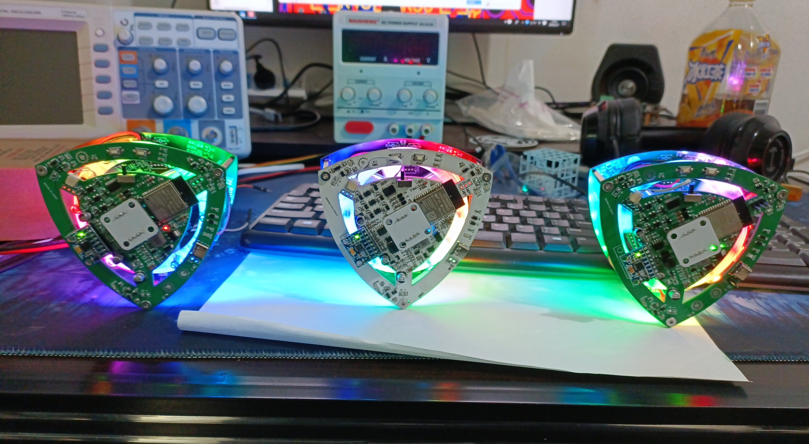

# 自平衡莱洛三角形可充电版

### 介绍
**在B站[“基于LQR控制器的自平衡莱洛三角形”](https://www.bilibili.com/video/BV19v411n7mN) 基础上添加了充电模块**
主控芯片使用ESP32，并配置了调参上位机，可以很方便的通过wifi无线调参。无刷控制使用灯哥开源FOC。制作出一个方便复刻的自平衡莱洛三角形，在桌面上作为一个摆件还是非常不错的
[展示视频](https://www.bilibili.com/video/BV1b3411x7za)

V1(图一)

V2(图二)

目前有两个版本
- V1(图1)：ESP32主控+L6234驱动+GB2204电机+CH340串口芯片+CS5095充电芯片
- V2(图2)：ESP32主控+EG2133+6mos驱动+2715电机+RGB+CM1010-A均衡芯片+CN3300充电芯片

**推荐制作V2，成功率高，效果更好，电机驱动芯片更便宜，还有RGB**

V1和V2**`电路图以及代码`**均在对应`V1\V2`文件夹(如需制作只要打开对应版本的文件夹即可，里面有对应的README说明)

### 1 软件架构
自平衡控制为LQR算法输出期望**速度**，使动量轮**加速运动**从而控制三角形左右方向。并且代码的调参都可以通过连接ESP32的wifi调整。具体特性如下：

- **基于 Arduino**：运行在 ESP32 Arduino 上
- **自带测试模式**：电压测试和速度测试，可以单独输出电压让电机转动，也可以设置指定速度让电机保持速度

### 2 硬件特性

| 说明             | 参数     |
| ---------------- |---------------------- |
| 莱洛三角形尺寸             | 100*100 mm  |
|动量轮尺寸|80*80 mm|
| 输入电压         | 3.7v锂电池*3|
|充电电压| 5V 从Type-C口输入|
| 主控芯片             | ESP-WROOM-32           |
|电机驱动|引脚:32, 33, 25|
|  AS5600 编码器 |SDA-23 SCL-5 　芯片要离径向磁铁有 2mm以上高度 |
| MPU6050六轴传感器  | SDA-19 SCL-18         |

### 3 硬件设计
使用立创EDA绘制电路原理图，LaserMaker绘制莱洛三角形和动量轮（有激光切割机可以事先切割结构作为参考）。将绘制完的图形导入到立创EDA中可作为PCB的外框。丝印图案分别是**Gawr Gura**、**ouro kronii** ~~helicopter~~

LaserMaker绘制的plt在**莱洛三角结构**文件夹内，需要重新绘制电路图可以使用

感谢嘉立创的PCB制板，使DIY电路制作变得非常便利，PCB制作开源点击

### 4 Ctrl+C +V（参考）
Arduino上的控制算法是原作者的LQR，无刷电机控制是灯哥开源FOC。电机控制引脚定义与传感器定义和灯哥开源FOC控制板2.0版一样。

EG2133无刷驱动为立创开源方案。

Python的GUI是以SimpleFOC的SimpleFOCStudio为基础，添加wifi功能。

V1的充电电路是立创广场开源的CS5095充电方案。

V2的充电电路是在立创广场开源的《CN3300 4串电池组板》方案基础上改的3串锂电池

PCB以及原理图技术支持——muyan

wifi效果以及按键面修复代码作者——muyan

1. 原作者：基于LQR控制器的自平衡莱洛三角形[BV19v411n7mN](https://www.bilibili.com/video/BV19v411n7mN)
2. muyan 立创链接[https://oshwhub.com/muyan2020?tab=project&page=1](https://oshwhub.com/muyan2020?tab=project&page=1)
3. muyan git链接[https://gitee.com/muyan3000](https://gitee.com/muyan3000)
4. EG2133驱动参考[https://oshwhub.com/acmetech-lceda/minifoc](https://oshwhub.com/acmetech-lceda/minifoc)
5. 灯哥开源FOC [https://gitee.com/ream_d/Deng-s-foc-controller](https://gitee.com/ream_d/Deng-s-foc-controller)
6. CS5095充电芯片电路[https://oshwhub.com/Aknice/cs5095e-san-jie-li-dian-chi-sheng-ya-chong-dian-dian-lu](https://oshwhub.com/Aknice/cs5095e-san-jie-li-dian-chi-sheng-ya-chong-dian-dian-lu)
7. CN3300 4串电池组板[https://oshwhub.com/583703056a/dian-chi-zu-ban_copy_copy](https://oshwhub.com/583703056a/dian-chi-zu-ban_copy_copy)
8. Arduino-Esp32环境提供者[https://github.com/kaliCYH](https://github.com/kaliCYH)

### 5 有用的地方

1. Arduino的程序中的command.h、command.cpp可以支持任意的字符串输入。在其他项目中一样可以用，无论是wifi接收到的字符串数据或者是串口的字符串数据。

2. GUI上位机可以在其他wifi项目中可以继续使用，用来调参还是很方便。

### 6 未解之谜

问题1：在传感器读取当前角度pitch在0和360来回切换时候，卡尔曼滤波值会慢慢变化，得到的值无法反映正确的当前角度。导致有一个面无法摇摆平衡。（已解决）（使用muyan的代码完美解决）

问题2：摇摆到平衡态时，参数不太好时，可能会摇摆过头，或者一直左右摇摆不能到平衡态。就算调好参数也会偶尔发生摇摆过头现象。（V2的2715电机可以让摇摆平衡的成功率提高到80%）

### 7 交流Q群

45coll电子交流QQ群：**824113552**

欢迎交流与沟通

