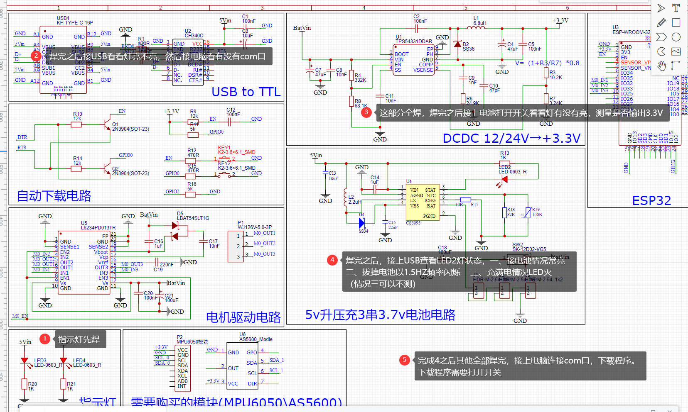

# V1自平衡莱洛三角形可充电版

#### 介绍
该版本为2021/9/23制作的版本，参考灯哥开源的原理图。

#### 1 制作说明

pcb推荐焊接顺序，建议初学者用电烙铁焊

#### 2 硬件特性

| 说明            | 参数                                                      |
|---------------|---------------------------------------------------------|
| 莱洛三角形尺寸       | 100*100 mm                                              |
| 动量轮尺寸         | 80*80 mm                                                |
| 电池*3          | 厚x长x宽:7.9mmx25mmx40mm 规格内均可                             |
| 输入电压          | 3.7v锂电池*3                                               |
| 充电电压          | 5V 从Type-C口输入                                           |
| 充电芯片CS5095    | 5V输入,最大1.2A充电电流                                         |
| 串口芯片CH340C    | 需要 打开开关 才能下载                   |
| 主控芯片          | ESP-WROOM-32                                            |
| 电机驱动芯片L6234PD | 引脚:32, 33, 25, 22; 22为enable                            |
| AS5600 编码器    | SDA-23 SCL-5 　芯片要离磁铁有 2mm以上高度  |
| MPU6050六轴传感器  | SDA-19 SCL-18                                           |

| LED指示灯 | 功能                                                                   |
|--------|----------------------------------------------------------------------|
| LED3   | typec的5V输入指示灯  接typec一定亮                                             |
| LED4   | 3.3v指示灯 电池输入12v输出3.3V                                                |
| LED2   | 充电指示灯 接上typec后LED3亮起，情况1：接电池LED2常亮；情况2：没接电池LED2以1.5HZ频率闪烁；情况3：电池充满灭灯 |
#### 3 使用说明

1. 下载完本git所有文件后，打开arduino文件夹，解压arduino.7z完成之后双击运行esp32_package_1.0.6.exe安装esp32库环境。注意：若之前有安装过arduino，请将路径`C:\Users\用户名\AppData\Local\`的Arduino15文件夹和`此电脑\文档`内的Arduino 删除 （~~也可自行下载Arduino并安装SimpleFOC~~）（但是可能会版本不对电机不动）
2. 打开解压后的arduino文件夹内的arduino.exe，导航栏-文件-打开。选择v1\main里面的main.ino
3. 烧录程序到ESP32：选择工具-开发板-esp32 Arduino-ESP32 Dev module，然后连接USB口选择对应的com口，编译上传。
   1. 　 如无法正常编译 
      1. 可能与原有arduino冲突，请查看使用说明第一条
      2. 文件夹路径含有非法字符，可以把Arduino移动到硬盘根目录下，如D:\Arduino
4. 打开本项目内的`python_gui`内的`可执行文件_main`内的**main.exe**并连接上WIFI：ESP32 密码：12345678。点击设置开始调参。
5. 连接成功后，点击disable，然后逆时针拨动动量轮，查看上位机中V参数是否为正值。注意！如果 逆时针转为为负值 那么需要将电机线任意两线互换。

6. 如果电机不能正常运行可以，点击上位机中最下方的 测试部分 ，打开电压或者速度测试，滑动滑条，查看电机能否正常运行。如还不能请检测硬件电路部分。
7. 如果不能摇摆直立，推荐调整的参数为TA、SA、SV
8. K值可以用滑块调整，拖动滑块就会发送参数命令，但是调整到合适值之后需要自行在Arduino的main中修改再烧录一次

9. 滑条：最左边输入框为滑块下限，右边是滑块上限，滑条等分成**200**份，命令是**字符串**，滑动滑块发送**字符串** + **数值**

比如让平衡角度为90度，则输入：TA90，并且会存入eeprom的位置0中 注：wifi发送**命令不能过快**，因为每次都会保存进eeprom，K参数没有保存到EEPROM所以可以使用滑条调整。

|   参数命令           | 说明    |
| ---------------- |---------------------- |
| TA | target_angle平衡角度 例如TA89.3 设置平衡角度89.3| 
| SV | swing_up_voltage摇摆电压 左右摇摆的电压，越大越快到平衡态，但是过大会翻过头|
|SA|swing_up_angle摇摆角度 离平衡角度还有几度时候，切换到自平衡控制|
|VP1|速度环的PID的P，1是稳定在平衡角度之前的P值|
|VI1|速度环的PID的I，1是稳定在平衡角度之前的I值|
|VP2|速度环的PID的P，2是稳定后的P值|
|VI2|速度环的PID的I，2是稳定后的I值|
|K为LQR参数|**3和4**是速度控制稳定前和后|
|K3**1**|LQR的参数1：稳定前的角度差值|
|K3**2**|LQR的参数2：稳定前的左右倾倒加速度|
|K3**3**|LQR的参数3：稳定前的当前速度|
|K4**1**|LQR的参数1：稳定后的角度差值|
|K4**2**|LQR的参数2：稳定后的左右倾倒加速度|
|K4**3**|LQR的参数3：稳定后的当前速度|

LQR算法解释：当三角形向←倾斜时，需要产生向→的力回正。

在电压控制下：回正力F直接和输出电压值挂钩，向←倾斜，电机提供正电压V动量轮向**左加速转动**，产生向右的力F。

`期望电压 = 角度差值x参数1 + 左右倾倒加速度x参数2 + 当前速度x参数3`

在速度控制下：回正力F和动量轮转速加速度a有关，F = ma，向←倾斜，电机需要向**左加速转动**，产生向右的力F。

`期望速度 = 角度差值x参数1 + 左右倾倒加速度x参数2 + 当前速度x参数3`

两者区别：电压和速度控制都可以实现平衡，但因为使用simpleFOC控制电机转速无法无限加速，本电机实验最高转速180转，电压到上限12v。

使用电压控制会遇到，电机一下子就到了转速上限，就不能提供稳定的力F，参数调起来比较困难。

速度控制可以在偏差变大的时候，根据期望速度产生最大电压12v，并且不会超过电机最高转速。
#### 4 硬件设计
使用立创EDA绘制电路原理图，LaserMaker绘制莱洛三角形和动量轮（有激光切割机可以事先切割结构作为参考）。将绘制完的图形导入到立创EDA中可作为PCB的外框。丝印图案分别是**Gawr Gura**、**ouro kronii** ~~helicopter~~

LaserMaker绘制的plt在**莱洛三角结构**文件夹内，需要重新绘制电路图可以使用

感谢嘉立创的PCB制板，使DIY电路制作变得非常便利，点击下方超链接可以前往嘉立创进行PCB制板

[莱洛三角形PCB](https://oshwhub.com/45coll/zi-ping-heng-di-lai-luo-san-jiao_10-10-ban-ben)

[动量轮](https://oshwhub.com/45coll/lai-luo-san-jiao-dong-liang-lun)

具体需要购买的物品在**物料清单.xlsx**中，如果缺货请自行某宝更换

#### 5 Ctrl+C +V（参考）
Arduino上的控制算法是原作者的LQR，无刷电机控制是灯哥开源FOC。电机控制引脚定义与传感器定义和灯哥开源FOC控制板2.0版一样。

Python的GUI是SimpleFOC的SimpleFOCStudio。

充电电路是立创广场开源的CS5095充电方案。
1. 原作者：基于LQR控制器的自平衡莱洛三角形[BV19v411n7mN](https://www.bilibili.com/video/BV19v411n7mN)
2. 灯哥开源FOC [https://gitee.com/ream_d/Deng-s-foc-controller](https://gitee.com/ream_d/Deng-s-foc-controller)
3. 充电芯片电路[https://oshwhub.com/Aknice/cs5095e-san-jie-li-dian-chi-sheng-ya-chong-dian-dian-lu](https://oshwhub.com/Aknice/cs5095e-san-jie-li-dian-chi-sheng-ya-chong-dian-dian-lu)
4. Arduino环境提供者[https://github.com/kaliCYH](https://github.com/kaliCYH)

#### 6 有用的地方

1. Arduino的程序中的command.h、command.cpp可以支持任意的字符串输入。在其他项目中一样可以用，无论是wifi接收到的字符串数据或者是串口的字符串数据。

2. GUI上位机可以在其他wifi项目中可以继续使用，用来调参还是很方便。

