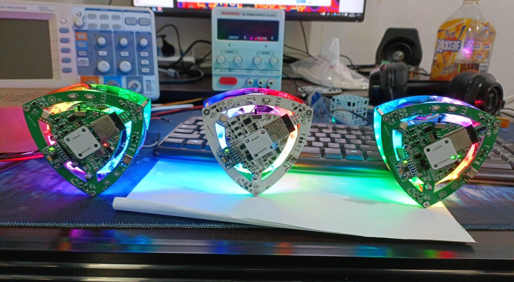

# V2自平衡莱洛三角形可充电RGB版

### 介绍
该版本为2022/3/3制作的版本，无刷驱动使用EG2133可以成功使用esp32-arduino的simplefoc驱动。但是特殊情况下会mos管击穿冒烟，请使用带保护的锂电池，以防发生意外

`程序附件都在`gitee[https://gitee.com/coll45/foc]（https://gitee.com/coll45/foc）

图片中间为立创smt版本，左为加热焊台一次焊成，右为使用热风枪分区域焊成。均可以摇摆平衡，使用2715电机

- mos管可以全部换成**AP2300**（更便宜一些），立创商城有售，测试过可以实现foc控制`（原理图用AO3400只是因为它是SMT基础库）`

- cn3300充电部分设计充电截至电压12.9V（考虑到电池内阻，最终充满电压为12.43V），充电电流0.5A，电感电流1.5A。充电功率为7.5W`（充电会电感部分会烫，但不至于烧毁电路）`

- 电机可以适配GB2204和2715无刷电机`(2715的平衡成功率高，因为KV值小)`

### 1 制作说明
[原理图以及PCB图链接](https://oshwhub.com/45coll/zi-ping-heng-di-lai-luo-san-jiao_10-10-ban-ben_copy)
1. 在立创开源链接中，点击`在编辑器中打开`，进入EDA页面，双击对应的PCB，上方导航栏找到-制造-PCB制板文件（gerber）-生成gerber-一键PCB/SMT下单。（一定要进编辑器！！！有遇到过开源链接的bom和真实bom对不上的情况）
2. 在下单页面中下单对应的pcb，如需SMT（机器贴片）可以选需要SMT，不选SMT会得到PCB空板（SMT到手之后需要焊30几个元器件，PCB空板为181个）
3. `淘宝购买`的表格是SMT和普通空板都要购买的
4. 普通空板，`BOM_莱洛三角V2`可以直接从立创商城**bom导入里面导入**
5.  一定需要经向磁铁，物料清单里面已经给出，二选一（磁环方便但是邮费贵，圆柱磁铁便宜包邮需要自行粘贴）
6. 焊接是基本功，最好是有风枪+烙铁的情况下尝试制作。

SMT注意：
- 选择需要SMT完成下单之后，进入订单界面。SMT分板定位孔选择-嘉立创添加，BOM与坐标清单选择-用我自己的BOM和坐标，导出文件选择-立创EDA。
- 需要上传的坐标文件和bom，都是在`EDA页面`-莱洛三角形PCB-制造-（物料清单BOM和坐标文件）中导出。
- 进入BOM匹配之后，左上角贴片数量选择-做5贴2（因为莱洛三角形制作一个需要两个PCB板，一个有元器件一个空板），贴片层-只贴顶层，产品类型-经济型，坐标文件生成方式-单板
- 强烈建议删除所有**扩展库以及推荐库**后打板`也可以删除AO3400这样可以便宜15元`（费用**做5贴2只需要90元**左右）
- SMT下单完成之后，只需购买`BOM_SMT购买专用_莱洛三角V2`，同样是从立创商城bom导入
- `BOM_SMT购买专用_莱洛三角V2`中给出的MOS管将AO3400替换成了AP2300

### 2 硬件特性

| 说明           | 参数                                                      |
|--------------|---------------------------------------------------------|
| 莱洛三角形尺寸      | 100*100 mm                                              |
| 动量轮尺寸        | 80*80 mm                                                |
| 电池*3         | 厚x长x宽:7.9mmx25mmx40mm 规格内均可                             |
| 输入电压         | 3.7v锂电池*3                                               |
| 充电电压         | 5V 从Type-C口输入                                           |
| 充电芯片CN3300   | 5V输入,最大1.5A充电电流                                         |
| 均衡芯片CM1010-A | 电池电压超过4.25V之后开始放电                                       |
| 主控芯片         | ESP-WROOM-32                                            |
| 电机驱动芯片EG2133 | 引脚:32, 33, 25                                           |
| 稳压芯片TPS54331DR         | 设置电池电压低于9V不工作，输出5.22V                                   |
| AS5600 编码器   | SDA-23 SCL-5 　芯片要离磁铁有 2mm以上高度  |
| MPU6050六轴传感器 | SDA-19 SCL-18                                           |
| RGB灯-WS2812  | 使用GPIO16控制                                              |

| LED指示灯      | 功能                                  |
|-------------|-------------------------------------|
| LED1        | 串口指示灯，ESP32发送串口数据时会亮起               |
| LED2        | 充电完成指示灯，亮起表示充电完成，充到亮起可能需要2-3小时      |
| LED30       | 充电指示灯，亮起表示正在充电                      |
| LED3        | typec的5V输入指示灯  接typec一定亮            |
| LED4        | 3.3v指示灯 电池输入12v输出3.3V               |
| LED5        | 由GPIO4控制，电池电压低于9.5V时以1HZ频率闪烁        |
| LED27\28\29 | 均衡指示灯，亮起表示该电池电压高于4.25V正在通过22欧姆电阻放电中 |

| 触摸盘   | 功能                                    |
|-------|---------------------------------------|
| 单击时长  | 100ms以上                               |
| 长按时长  | 800ms以上                               |
| 点赞触摸盘 | GPOI13-Touch4-单击:开关RGB灯；长按：开关wifi和电机  |
| 投币触摸盘 | GPOI15-Touch3-单击：增加RGB灯亮度；长按：下一个RGB灯效 |
| 收藏触摸盘 | GPOI2-Touch2-单击：减少RGB灯亮度；长按：上一个RGB灯效  |
### 3 使用说明

1. 下载完本git所有文件后，打开arduino文件夹，解压arduino.7z完成之后双击运行esp32_package_1.0.6.exe安装esp32库环境。注意：若之前有安装过arduino，请将路径`C:\Users\用户名\AppData\Local\`的Arduino15文件夹和`此电脑\文档`内的Arduino 删除 （~~也可自行下载Arduino并安装SimpleFOC~~）（但是可能会版本不对电机不动）
2. 打开解压后的arduino文件夹内的arduino.exe，导航栏-文件-打开。选择v2\main里面的main.ino
3. 使用CH340下载器，将下载器的TXD\RXD\GND用杜邦线引出，对准PCB的ESP32正上方的GND\RXD\TXD，接法为TXD-TXD\RXD-RXD\GND-GND
4. 将烧录程序到ESP32：选择工具-开发板-esp32 Arduino-ESP32 Dev module，然后连接USB口选择对应的com口，编译上传。
   1. 　 如无法正常编译 
      1. 可能与原有arduino冲突，请查看使用说明第一条
      2. 文件夹路径含有非法字符，可以把Arduino移动到硬盘根目录下，如D:\Arduino
5. 如需修改参数，长按点赞触摸盘，可以打开wifi并停止电机。
6. 打开本项目内的`python_gui`内的`可执行文件_main`内的**main.exe**并连接上WIFI：ESP32 。点击设置开始调参。
7. 连接成功后，点击disable，然后逆时针拨动动量轮，查看上位机中V参数是否为正值。注意！如果 逆时针转为为负值 那么需要将电机线任意两线互换。

8. 如果电机不能正常运行可以，点击上位机中最下方的 测试部分 ，打开电压或者速度测试，滑动滑条，查看电机能否正常运行。如还不能请检测硬件电路部分。
9. 如果不能摇摆直立，推荐调整的参数为TA、SA、SV
10. K值可以用滑块调整，拖动滑块就会发送参数命令，但是调整到合适值之后需要自行在Arduino的main中修改再烧录一次

11. 滑条：最左边输入框为滑块下限，右边是滑块上限，滑条等分成**200**份，命令是**字符串**，滑动滑块发送**字符串** + **数值**

比如让平衡角度为90度，则输入：TA90，并且会存入eeprom的位置0中 注：wifi发送**命令不能过快**，因为每次都会保存进eeprom，K参数没有保存到EEPROM所以可以使用滑条调整。

|   参数命令           | 说明    |
| ---------------- |---------------------- |
| TA | target_angle平衡角度 例如TA89.3 设置平衡角度89.3| 
| SV | swing_up_voltage摇摆电压 左右摇摆的电压，越大越快到平衡态，但是过大会翻过头|
|SA|swing_up_angle摇摆角度 离平衡角度还有几度时候，切换到自平衡控制|
|VP1|速度环的PID的P，1是稳定在平衡角度之前的P值|
|VI1|速度环的PID的I，1是稳定在平衡角度之前的I值|
|VP2|速度环的PID的P，2是稳定后的P值|
|VI2|速度环的PID的I，2是稳定后的I值|
|K为LQR参数|**3和4**是速度控制稳定前和后|
|K3**1**|LQR的参数1：稳定前的角度差值|
|K3**2**|LQR的参数2：稳定前的左右倾倒加速度|
|K3**3**|LQR的参数3：稳定前的当前速度|
|K4**1**|LQR的参数1：稳定后的角度差值|
|K4**2**|LQR的参数2：稳定后的左右倾倒加速度|
|K4**3**|LQR的参数3：稳定后的当前速度|

LQR算法解释：当三角形向←倾斜时，需要产生向→的力回正。

在电压控制下：回正力F直接和输出电压值挂钩，向←倾斜，电机提供正电压V动量轮向**左加速转动**，产生向右的力F。

`期望电压 = 角度差值x参数1 + 左右倾倒加速度x参数2 + 当前速度x参数3`

在速度控制下：回正力F和动量轮转速加速度a有关，F = ma，向←倾斜，电机需要向**左加速转动**，产生向右的力F。

`期望速度 = 角度差值x参数1 + 左右倾倒加速度x参数2 + 当前速度x参数3`

两者区别：电压和速度控制都可以实现平衡，但因为使用simpleFOC控制电机转速无法无限加速，本电机实验最高转速180转，电压到上限12v。

使用电压控制会遇到，电机一下子就到了转速上限，就不能提供稳定的力F，参数调起来比较困难。

速度控制可以在偏差变大的时候，根据期望速度产生最大电压12v，并且不会超过电机最高转速。
### 4 硬件设计
使用立创EDA绘制电路原理图，LaserMaker绘制莱洛三角形和动量轮（有激光切割机可以事先切割结构作为参考）。将绘制完的图形导入到立创EDA中可作为PCB的外框。丝印图案分别是**Gawr Gura**、**ouro kronii** ~~helicopter~~

LaserMaker绘制的plt在**莱洛三角结构**文件夹内，需要重新绘制电路图可以使用

感谢嘉立创的PCB制板，使DIY电路制作变得非常便利，点击下方超链接可以前往嘉立创进行PCB制板

[莱洛三角形V2PCB](https://oshwhub.com/45coll/zi-ping-heng-di-lai-luo-san-jiao_10-10-ban-ben_copy)

### 5 Ctrl+C +V（参考）
Arduino上的控制算法是原作者的LQR，无刷驱动为立创开源的EG2133方案。

Python的GUI是以SimpleFOC的SimpleFOCStudio为基础，添加wifi功能。

V2的充电电路是在立创广场开源的《CN3300 4串电池组板》方案基础上改的3串锂电池

PCB以及原理图技术支持——muyan

wifi效果以及按键面修复代码作者——muyan

1. 原作者：基于LQR控制器的自平衡莱洛三角形[BV19v411n7mN](https://www.bilibili.com/video/BV19v411n7mN)
2. muyan立创链接[https://oshwhub.com/muyan2020?tab=project&page=1](https://oshwhub.com/muyan2020?tab=project&page=1)
3. muyan git链接[https://gitee.com/muyan3000](https://gitee.com/muyan3000)
4. EG2133驱动参考[https://oshwhub.com/acmetech-lceda/minifoc](https://oshwhub.com/acmetech-lceda/minifoc)
5. 灯哥开源FOC [https://gitee.com/ream_d/Deng-s-foc-controller](https://gitee.com/ream_d/Deng-s-foc-controller)
6. CN3300 4串电池组板[https://oshwhub.com/583703056a/dian-chi-zu-ban_copy_copy](https://oshwhub.com/583703056a/dian-chi-zu-ban_copy_copy)
7. Arduino环境提供者[https://github.com/kaliCYH](https://github.com/kaliCYH)

### 6 有用的地方

1. Arduino的程序中的command.h、command.cpp可以支持任意的字符串输入。在其他项目中一样可以用，无论是wifi接收到的字符串数据或者是串口的字符串数据。

2. GUI上位机可以在其他wifi项目中可以继续使用，用来调参还是很方便。

